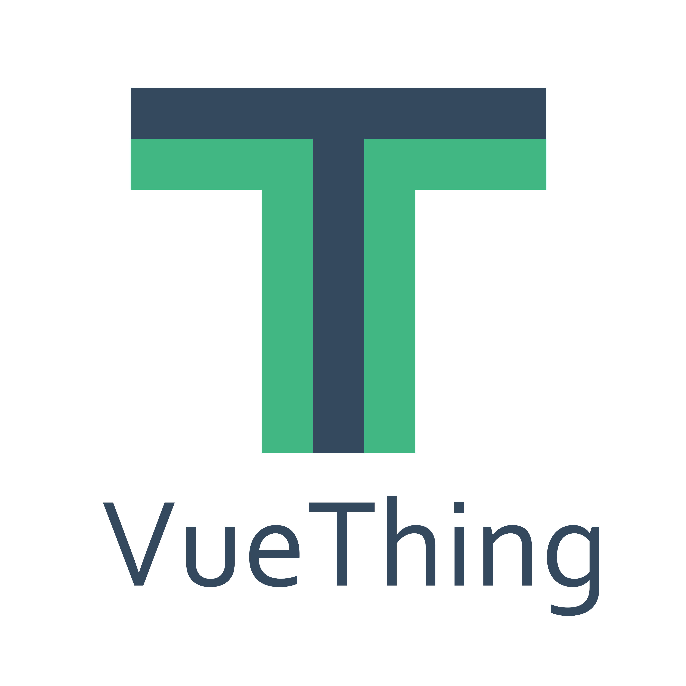

 
A 2D/3D hooks library based on Vue3

 

## 🚀 Features

[//]: # (- 🎪 [**Interactive docs & demos**]&#40;https://vueuse.org&#41;)

- 💡 **Vue3.0 & Vite2**: 基于 **Vue3** & **vite2** 快速开发
- ⚡️ **适配ES Module**: 开箱即用，只拿你想拿的
- 🦾 **强类型**: 使用TypeScript 编写，带有完整的TS 文档
- 🎪 **带有演示的文档** 功能的文档还附带交互式演示!
- 📦 **多元性**: 具有thing.js、three.js、webGl等 hooks 选择

## 🦾 OSCS

